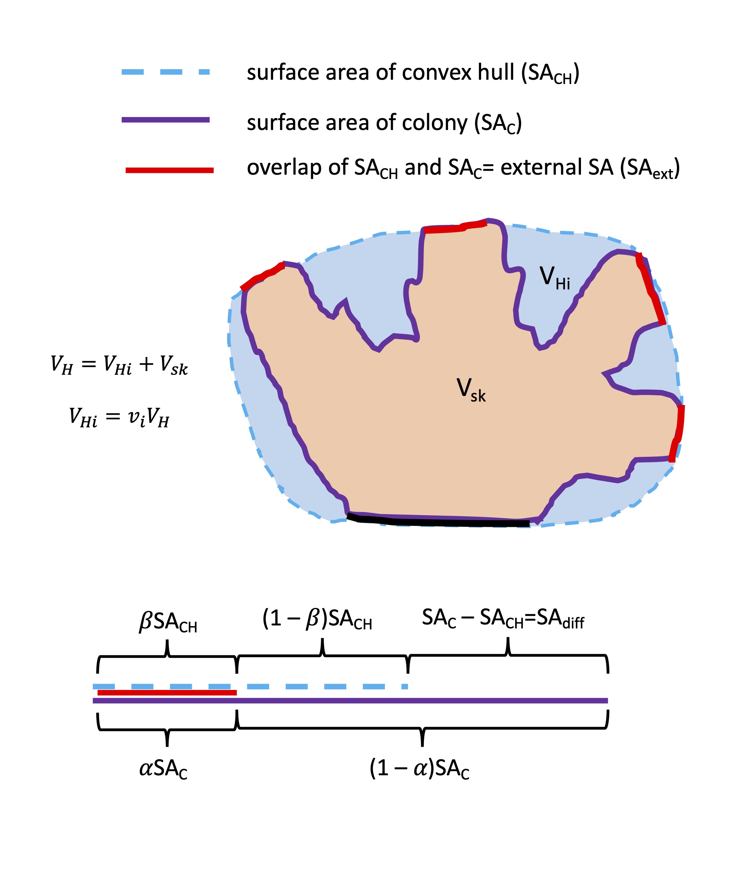

```{r setup, include=FALSE}
knitr::opts_chunk$set(echo = TRUE)
```

This supplement provides details on estimation of parameter values for the model described in "Fertilization by coral-dwelling fish promotes coral growth but can exacerbate bleaching response" by A.R. Detmer, R. Cunning, F. Pfab, A.L. Brown, A.C. Stier, R.M Nisbet, and H.V. Moeller. It was knit from an RMarkdown document that can be found at https://github.com/raine-detmer/Fish-Excretion-Model. Note that the R code for each output in this document can be shown or hidden using the "Code" buttons on the righthand side of the page.


The empirical data we used to estimate model parameters were largely from reefs on Mo'orea, French Polynesia. Where possible, we focused on *Pocillopora* corals for consistency among different data sources. For parameters that were also in the original coral-algal DEB model, we used the same values as in Cunning et al. 2017 (details can be found in the Cunning et al. supplement). 

```{r, include=FALSE}
#load required packages
library(tidyverse)
library(openxlsx)#for importing .xlsx files from url
library(quantreg)#for running quantile regressions
```

#Estimating kv

The relationship between host tissue biomass and colony volume is given by
$$V_H = k_{V}*H^\gamma$$. 

Assuming $\gamma$=1, this becomes

$$V_H=k_{V}*H$$
Where $V_{H}$ is in L, H is in C-mol, and $k_{v}$ has units of L/C-mol.

We used data from Edmunds & Burgess (2016) to estimate $k_{v}$. These data include colony diameter and surface area (estimated with wax dipping) for *Pocillopora verrucosa* colonies in Mo'orea, French Polynesia. To convert diameter to total colony volume, we assumed the colonies were hemispherical. To convert surface area to tissue biomass in C-mol, we used:

1) mean *Pocillopora* spp. tissue biomass from Mo'orea time series data to convert from colony surface area to tissue biomass

2) host tissue carbon content reported in Schutter et al. 2010 (0.414 gC/g AFDW tissue) to convert tissue biomass to units of C-mols. 


### Estimating coral tissue biomass
To estimate coral tissue biomass, we used data collected as part of the NSF Rules of Life E5 project on environmental-energetic-epigenetic linkages in reef building corals (https://e5coral.org). Biomass data were collected by sampling tissue from corals of three species (massive *Porites*, *Acropora pulchra*, and *Pocillopora* spp.) from three lagoon reef sites on the north shore of Mo'orea, French Polynesia across four time points (January, March, September, and November of 2020). Tissue was removed from the coral skeleton by air brushing followed by centrifugation to separate the coral host tissue and symbiont fractions. Respective fractions were dried at 80°C for 24 h and then burned at 450°C for 4-6 h. Ash free dry weight was calculated as the difference in dry and burned tissue weight (g/mL) and normalized to sample surface area (cm^2) to obtain host tissue and symbiont biomass. We used these data to compute the overall average host tissue biomass (across all sampled sites and all timepoints) for each species.

```{r}
#import the summary of the time series data (mean values of all responses for each species at each site at each timepoint)
timeseries_summ<-read.csv("./E5_TS_Summary_Responses.csv")

#create a new data frame with everything summarized by species
total_biomass_summary <- timeseries_summ %>% 
  # use group_by() to tell R to consider different groups in the data: group by species
  group_by(species) %>% 
  # use summarize() to calculate the mean tissue biomass of each group
  summarize(mean = mean(Host_AFDW.mg.cm2, na.rm=TRUE)) 

total_biomass_summary

```

We used the mean AFDW for *Pocillopora* spp, 1.60 mg/cm^2

### Relating tissue biomass to colony volume

We used data from Edmunds & Burgess (2016) on *Pocillopora verrucosa* to relate colony surface area to total colony volume. These data are publically available in the LTER Network Catalog (we used the revised version of the data, which can be found here: https://portal.edirepository.org/nis/mapbrowse?scope=knb-lter-mcr&identifier=5018&revision=12). The data on colony diameter and tissue surface area are in Sheet 2 (named "Table 1") of the "Tables and Figures" file (file name "MCR_LTER_Edmunds_JExpBiol2016_TablesFigures.xlsx"). 

```{r}
#import Edmunds & Burgess 2016 data on Pocillopora verrucosa
#use the data that include the diameter and surface area (determined using wax dipping) of each colony 
import_p_verr_data <- read.xlsx("https://portal.edirepository.org/nis/dataviewer?packageid=knb-lter-mcr.5018.12&entityid=9e010c92ea95abebe09aa26cb70df5ed", sheet=2)

#clean up the data
p_verrucosa_size_area <- import_p_verr_data[-1, ]
colnames(p_verrucosa_size_area) <- c("trial", "size_class", "coral_id", "diameter_cm", "area_cm2", "weight_g")
p_verrucosa_size_area$diameter_cm <- as.numeric(p_verrucosa_size_area$diameter_cm)
p_verrucosa_size_area$area_cm2 <- as.numeric(p_verrucosa_size_area$area_cm2)

```

We then estimated $k_{v}$ by fitting a linear model to the relationship between colony tissue mass in C-mols and colony volume.

```{r}
#converting colony diameter to volume (assuming colonies are hemispherical)
p_verrucosa_size_area$volume_L<-2/3*pi*(1/2*p_verrucosa_size_area$diameter_cm/100)^3*1000

#from Mo'orea time series data, overall mean tissue biomass for Pocillopora spp. is 1.60 mg/cm^2;  molC/g biomass = gBiomass * 0.414 gC/gBiomass * 1molC/12.011gC 
p_verrucosa_size_area$tissue_mass_Cmol<-p_verrucosa_size_area$area_cm2*0.00160*0.414 / 12.011

#fit linear model to tissue biomass vs. colony volume
lm.pverr.Cmol.L <- nls(volume_L~m*tissue_mass_Cmol+b,start = list(m = 1, b=1), data=p_verrucosa_size_area)
summary(lm.pverr.Cmol.L)
lm.pverr.Cmol.L.m <- summary(lm.pverr.Cmol.L)$coefficients[1,1]
lm.pverr.Cmol.L.b <- summary(lm.pverr.Cmol.L)$coefficients[2,1]

#plot the data and the fitted model
plot(x=p_verrucosa_size_area$tissue_mass_Cmol, y=p_verrucosa_size_area$volume_L, xlab="biomass (Cmol)", ylab="approx. volume (L)",main="Relationship between tissue biomass and colony volume", pch=16)
abline(a=lm.pverr.Cmol.L.b, b=lm.pverr.Cmol.L.m, lwd=2, col="blue")
text(x=0.032, y=0.38, labels="kv=16.9 L/C-mol", col="blue")

```

From these data, we estimated a value of $k_v$ = 16.9 L/C-mol


#Additional coral morphology parameters
To estimate additional morphological parameters, we used data from Zawada et al. (2019). In this study, morphological measurements of coral skeletons of various morphologies were made using laser scanning. Measurements included:

-	Outer SA ($SA_C$): the total surface area of the skeleton in contact with water (Total SA – SA of the skeleton that is attached to the substrate)

-	Colony Volume ($V_{sk}$): the volume of the colony skeleton

-	Convex Volume ($V_H$): the total volume of a colony (the volume of the convex hull surrounding the colony)

-	Convex SA ($SA_{CH}$): the total surface area of the convex hull 

- Convexity: the ratio of colony volume to the volume of the convex hull around the colony 

We used these data to estimate $\alpha$ (the fraction of host tissue-- and SA, assuming direct proportionality between tissue SA and biomass-- that is in direct contact with the external environment) and $v_i$  (the fraction of colony volume that is interstitial space); see the diagram below for a visualization of these morphological parameters.





We assumed that the external area ($\alpha*SA_C$) can be approximated as the area where the convex hull SA overlaps with the colony SA. The fraction of the convex hull SA that is touching the colony is given by $\beta$. Thus, 
$$\alpha{SA}_C=\beta{SA}_{CH} $$

We then made some more simplifying assumptions to solve for $\beta$:

- we assumed that the ratio of the surface area of the interstitial space $SA_{hole}$ (SA in and over the colony “holes”, i.e. the pockets of space between colony branches) to the sum of total surface area of the convex hull and the surface area of the colony is proportional to the ratio of the volume of the interstitial space to the total volume (convex hull volume):

$$\frac{{SA}_{hole}}{{SA}_{CH}+{SA}_C}\propto\frac{V_{Hi}}{V_H} $$
- $SA_{hole}$ is equal to the sum of the SA over the holes and the SA in the holes. We assumed that the surface area in the holes (i.e., the surface area of the tissue lining the interstitial space) is equal to the surface area over the holes plus the difference between the colony surface area and the convex hull surface area ($SA_{diff}$). Thus, the left side of the above expression can be written as:

$$ \frac{{SA}_{hole}}{{SA}_{CH}+{SA}_C}=\frac{{SA}_{over\ holes}+{SA}_{in\ holes}}{{SA}_{CH}+{SA}_C}=\frac{\left(1-\beta\right){SA}_{CH}+(\left(1-\beta\right){SA}_{CH}+{SA}_{diff})}{{SA}_{CH}+{SA}_C}=\frac{{SA}_C+{SA}_{CH}-2\beta{SA}_{CH}}{{SA}_{CH}+{SA}_C}$$

- We then further assumed that the two ratios were equal, allowing us to solve for $\beta$:
$$\frac{{SA}_C+{SA}_{CH}-2\beta{SA}_{CH}}{{SA}_{CH}+{SA}_C}=\frac{V_{Hi}}{V_H} $$
$$\beta=(\frac{1}{2{SA}_{CH}})({SA}_C+SA_{CH})(1-\frac{V_{Hi}}{V_H})$$
$\alpha$ was then calculated as
$$ \alpha=\beta\frac{{SA}_{CH}}{{SA}_c}$$

Thus, using these equations, we could estimate $\alpha$ from the empirical measurements made by Zawada et al. 2019 (but we note this is an extrememly rough approximation).

The data from Zawada et al. are publically available on FigShare (https://figshare.com/articles/dataset/CoralColonyMorphologyData_WholeColonies_MediumToHighQuality_LaserScanned/8115674). We used the newest version of these data (as of 10/2021), which is titled "3DLaserScannedColonies_MedToHighQuality_updatedFractalDimension.csv".

```{r}
#import the data
z_coral_morph <- read.csv("https://figshare.com/ndownloader/files/16356440")

```

```{r}
#calculate vi (fraction of colony volume that is interstitial space) for each specimen; this is equal to 1-Convexity
z_coral_morph$vi<-1-z_coral_morph$Convexity

#the volume of the interstitial space is the difference between the convex hull volume and the skeleton volume
z_coral_morph$VolInt<-z_coral_morph$ConvexVol-z_coral_morph$ColonyVol

#surface area of the convex hull that is in contact with the water (Total convex hull SA – SA of the skeleton that is attached to the substrate; this assumes that all of the total convex hull SA that is touching the substrate is overlapping completely with skeletal SA touching the substrate, so the skeleton SA on the substrate is equal to the convex hull SA on the substrate)
z_coral_morph$OuterConvexSA<-z_coral_morph$ConvexSA-(z_coral_morph$ColonySA-z_coral_morph$OuterSA)

#estimating beta for each colony (from above equations)
z_coral_morph$beta.est<-1/2*1/z_coral_morph$OuterConvexSA*(z_coral_morph$OuterConvexSA+z_coral_morph$OuterSA)*(1-z_coral_morph$VolInt/z_coral_morph$ConvexVol)

#estimating alpha for each colony (from above equations)
z_coral_morph$alpha.est<-z_coral_morph$beta.est*z_coral_morph$OuterConvexSA/z_coral_morph$OuterSA#beta-adjusted value of alpha

#look just at Pocillopora (focus on Pocillopora to be consistent with other parameter estimates)
P_dam<-z_coral_morph[z_coral_morph$Species == "Pdam", ]

```

### Estimating vi

```{r}
#look at vi vs. total volume to check that it stays roughly constant with colony size
plot(x=P_dam$ConvexVol, y=P_dam$vi, pch=16, xlab="volume of convex hull (mm^3)", ylab="fraction of volume filled with water", main="vi for Pocillopora", ylim=c(0,1))
#lm.vi.P_dam<-lm(P_dam$vi~P_dam$ConvexVol)
#abline(lm.vi.P_dam)
#summary(lm.vi.P_dam)#slope= -4.2e-08, significant (p=0.01), R^2=0.83

mean(P_dam$vi)#mean is 0.69596 -> 0.70

```

For *Pocillopora* specimens, the fraction of colony volume that was interstitial space did not show any strong trends with colony size (although there were very few data points).  We therefore assumed $v_i$ was constant and used the mean value, 0.7. 

### Estimating alpha
```{r}
#look at alpha vs. colony SA to check that it stays roughly constant with colony size
plot(x=P_dam$OuterSA, y=P_dam$alpha.est, pch=16, ylim=c(0,1), xlab="Colony SA (mm^2)", ylab="alpha", main="alpha for Pocillopora")
mean(P_dam$alpha.est)#mean is 0.232
```
As with $v_i$, the fraction of colony SA that was in contact with the external environment did not show any strong trends with colony size.  We therefore assumed $\alpha$ was constant and used the mean value, 0.23. 

#Estimating the flushing rate

The expression describing the exchange of nitrogen between the environment and interstitial space is given by
$$d(N_{env}-N_{i}) $$
Where the flushing rate d has units of 1/time (in the model, 1/d)

To estimate the flushing rate, we used data from Holbrook et al. (2008). This study measured retention times of dye injected in the interior of *Pocillopora* colonies in Mo'orea. The authors also measured the “percent openness” of each colony (calculated as the percentage of the overall colony area composed of colony lobes subtracted from 100, based on two dimensional photos of the top of the colony). Figure 6 of Holbrook et al. (2008) shows that the retention times ranged from approximately 30s (most open colony) to approximately 195s (least open colony), and the authors did not find an effect of mean flow speed upstream of the colony on retention time. 

We converted these retention times to units of days and took the reciprocal of the resulting values to estimate flushing rates of 2880/d (most open colony) and 440/d (least open colony). We used the mean of the resulting values, 1660/d, as our default flushing rate in the model. 

```{r}
#86400s/d
1/(30*1/86400)# d= 2880 1/d
1/(195*1/86400)# d= 443.0769 1/d

#mean of these values
(443.0769+2880)/2 #d= 1660

```

Holbrook et al. (2008) noted that rates of mass transfer within corals can be affected by both the flow conditions and the branching structure of the colony. Their dye retention experiments were performed during low flow conditions, so colony flushing rates could potentially be higher in high flow environments. 

#Estimating fish carrying capacity
We estimated $k_p$ (biomass of fish per C-mol H) from unpublished survey data associated with Holbrook et al. (2008). These data were obtained from scuba diver surveys conducted in 2005 by Sally J. Holbrook and Russell J. Schmitt in mid-lagoon areas between Opunohu Bay and Irihoriu Pass on the north shore of Moorea, FP., (17º 32’ S, 149º 50’ W). The data include the length, width, height, and circumference of *Pocillopora* sp. colonies and the number and size of several fish species associated with each colony. We used only the data on *Dascyllus flavicaudus* (yellowtail damselfish), as this was the most abundant species present (Holbrook et al. 2008).  

In these data, the total length of each individual fish was reported as falling within one of three size classes: total length less than 25 mm, between 25 and 69 mm, and greater than 70 mm. Since there was no information about how the sizes within each class were distributed, we assumed all fish in each class had a length equal to the midpoint of each class (12mm, 47mm, and 95mm); for the largest class, we used the midpoint between the lower bound of this class and the maximum recorded size for *D. flavicaudus* according to the Mo'orea Coral Reef LTER database (120mm). Lengths were converted to biomass using the formula given in the MCR data (MCR LTER:Reference: Fish Taxonomy, Trophic Groups, and Morphometry, knb-lter-mcr.6001.6; http://mcrlter.msi.ucsb.edu/cgi-bin/showDataset.cgi?docid=knb-lter-mcr.6001&displaymodule=entity&entitytype=dataTable&entityindex=2) :

weight in grams= a*(fork length in cm)^b

For *D. flavicaudus*, a= 0.046, b=2.911, and fork length= 0.924*total length 


```{r, warning=FALSE}
#import the raw data
fish_in_coral<-read.csv("./D. flavicaudus size frequency 2005 Pocillopora survey.csv")

#rename the columns
colnames(fish_in_coral) <- c("site", "coral_length_cm", "coral_width_cm","coral_height_cm", "coral_circum_cm", "L_less_than_25mm", "L_25_to_69_mm", "L_70mm_or_greater")

#width and ength have "nd" (for "no data") entries so were read in as character, need to convert them to numeric
fish_in_coral$coral_width_cm <- as.numeric(fish_in_coral$coral_width_cm)
fish_in_coral$coral_length_cm <- as.numeric(fish_in_coral$coral_length_cm)

#total fish biomass in grams on each colony is equal to: number in small*a*(0.924*1.2)^b + number in middle*a*(0.924*4.7)^b + number in large*a*(0.924*9.5)^b
fish_in_coral$total_biomass<-fish_in_coral$L_less_than_25mm*0.046*(0.924*1.2)^2.911 + fish_in_coral$L_25_to_69_mm*0.046*(0.924*4.7)^2.911 + fish_in_coral$L_70mm_or_greater*0.046*(0.924*9.5)^2.911

#total number of individuals in coral
fish_in_coral$total_fish<-fish_in_coral$L_less_than_25mm+fish_in_coral$L_25_to_69_mm+fish_in_coral$L_70mm_or_greater

```

We calculated the volume of each colony from its length, width, and height using the equation for the volume of an ellipsoid. We then converted this volume to C-mol of interstitial host biomass using our estimates of $k_v$ and $\alpha$. We assumed that fish carrying capacity scales with host biomass in the interstitial space (which is proportional to interstitial volume) rather than the biomass of the entire colony.

```{r}
#use height, length, and width to get the volume of the colonies (assume they are hemi-ellipsoids)
fish_in_coral$coral_volume<-NaN*fish_in_coral$total_biomass

#volume of an ellipsoid= 4/3*pi*a*b*c. a=height, b= 1/2length, c= 1/2 width, and the colony is approximately half an ellipsiod so the volume is given as V= 1/2(4/3*pi*h*1/2w*1/2l) = 1/6*pi*h*w*l
#measurements are in centimeters; to covert volume from cubic centimeters to L use the coversion: 1 cm^3 = 0.001 L
fish_in_coral$coral_volume[1:294]<-1/6*pi*fish_in_coral$coral_height_cm[1:294]*fish_in_coral$coral_width_cm[1:294]*fish_in_coral$coral_length_cm[1:294]*0.001#L/cm^3

#last coral in the data doesn't have length and width recorded, so just use V=2/3*pi*r^3, where r=C/(2pi)
fish_in_coral$coral_volume[295]<-2/3*pi*(fish_in_coral$coral_circum_cm[295]/(2*pi))^3*0.001#L/cm^3


#interstitial biomass: convert volume to biomass in C-mols using the our estimates of kv and alpha
fish_in_coral$coral_int_biomass_Cmol<-(1-0.23)*fish_in_coral$coral_volume/16.9

#calculate interstitial volume using our estimate of vi
fish_in_coral$coral_int_vol_L<-0.70*fish_in_coral$coral_volume#P. dam vi=0.70

```

We then fit a quantile regression to interstitial host biomass vs. fish biomass to estimate the relationship between interstitial host biomass and fish carrying capacity. 


```{r}
lm.Dflav.intH<-lm(fish_in_coral$total_biomass~fish_in_coral$coral_int_biomass_Cmol)
summary(lm.Dflav.intH)

qr.Dflav.intH.99<-rq(total_biomass~coral_int_biomass_Cmol, tau=0.99, data=fish_in_coral)
summary(qr.Dflav.intH.99)

qr.Dflav.intH.95<-rq(total_biomass~coral_int_biomass_Cmol, tau=0.95, data=fish_in_coral)
summary(qr.Dflav.intH.95)

qr.Dflav.intH.90<-rq(total_biomass~coral_int_biomass_Cmol, tau=0.90, data=fish_in_coral)
summary(qr.Dflav.intH.90)


plot(x=fish_in_coral$coral_int_biomass_Cmol, y=fish_in_coral$total_biomass, type="p", xlab="Coral interstitial tissue biomass (C-mol)", ylab="biomass fish (g)", pch=20, main="Quantile Regression for coral tissue biomass and fish biomass", col="black")
abline(qr.Dflav.intH.99, col="red", lty=2)
abline(qr.Dflav.intH.95, col="green", lty=2)
abline(qr.Dflav.intH.90, col="purple", lty=2)
abline(lm.Dflav.intH, col="black")
legend(x="topleft", legend=c("99%", "95%", "90%","lin model"), col=c("red", "green", "purple","black"), lty=c(2,2,2, 1))

#values of kp: 404 (99%), 266 (95%), 210 (90%)

```

We decided to use the more conservative 0.90 quantile, since there is potentially a lot of error in these estimates (for the coral biomass, coral colony volume was just approximated, then converted to biomass using conversion factors that were themselves estimated with a lot of potential error; for the fish, just the midpoints of the size classes were used which could potentially be over- or underestimating total biomass). Also, the variance in these data increased with increasing coral biomass, which meant there were some outliers for large corals that influenced the 0.95 and 0.99 regressions.

So, from this, the estimated value of $k_p$ is 210 g fish/interstitial host biomass

This says there are 210 g fish per interstitial C-mol coral. 1 C-mol interstitial tissue = 1.3 C-mol total tissue = total volume of 22L = hemispherical colony with a diameter of 44 cm and an interstitial volume of 0.7*22 = 15L. Assuming all fish are 4.7 cm (3.3 g), this would be around 60 fish in a colony of this size.

```{r}
#(1-alpha)*total C-mol = interstitial C-mol so total C-mol=interstitial/(1-alpha)
1/(1-0.23)#interstitial C-mol=1.298701

1.298701*16.9#volume=total C-mol*kv=21.94805L

#converting volume in liters to colony diameter, assuming a hemispherical colony (V=2/3*pi*r^3)
V.L_to_d.cm<-function(vol.L){
  diam.cm<-2*(3/2*1/pi*vol.L*1000)^(1/3)
  return(diam.cm)
}

V.L_to_d.cm(21.94805)#colony diameter=44cm

0.7*21.94805#volume of interstitial space=15L

#calculate biomass per fish, assuming fish are all 47mm
0.046*(0.924*4.7)^2.911#3.306022
#total biomass of 210g, 3.3 g/fish 
210/3.306#around 60 fish per colony
```

We repeated the above analyses assuming fish carrying capacity scales with interstitial volume instead of interstitial host biomass and fit a quantile regression to interstitial volume vs. fish biomass

```{r}
lm.Dflav.intV<-lm(fish_in_coral$total_biomass~fish_in_coral$coral_int_vol_L)
summary(lm.Dflav.intV)

qr.Dflav.intV.99<-rq(total_biomass~coral_int_vol_L, tau=0.99, data=fish_in_coral)
summary(qr.Dflav.intV.99)

qr.Dflav.intV.95<-rq(total_biomass~coral_int_vol_L, tau=0.95, data=fish_in_coral)
summary(qr.Dflav.intV.95)

qr.Dflav.intV.90<-rq(total_biomass~coral_int_vol_L, tau=0.90, data=fish_in_coral)
summary(qr.Dflav.intV.90)


plot(x=fish_in_coral$coral_int_vol_L, y=fish_in_coral$total_biomass, type="p", xlab="Colony interstitial volume (L)", ylab="biomass fish (g)", pch=20, main="Quantile Regression for coral interstitial volume and fish biomass", col="black")
abline(qr.Dflav.intV.99, col="red", lty=2)
abline(qr.Dflav.intV.95, col="green", lty=2)
abline(qr.Dflav.intV.90, col="purple", lty=2)
abline(lm.Dflav.intV, col="black")
legend(x="topleft", legend=c("99%", "95%", "90%","lin model"), col=c("red", "green", "purple","black"), lty=c(2,2,2, 1))

#values of kp: 26.3 (99%), 17.3 (95%), 13.66 (90%)

```

#Estimating fish excretion rate
To parameterize fish excretion, we used data for *Dascyllus flavicaudus* (the species also used to estimate fish carrying capacity, and the most abundant coral-dwelling fish in Holbrook et al. 2008) from Mo’orea. The average nitrogen excretion rates of *D. flavicaudus* are 0.1032 μg NH4/min/g fish and 0.1339 μg urea/min/g fish (D.E. Burkepile, personal communication). Assuming a constant excretion rate (which we note is an oversimplification), this gives an average nitrogen excretion rate of $e_p$= 1.5*10^-5 mol N/d/g fish. 


```{r}
#mean excretion rate of ammonium, in ug/min/g fish
mean.ugNH4.min.g <- 0.1032

#mean excretion rate of urea, in ug/min/g fish
mean.ugUrea.min.g <- 0.1339

#convert the means to mols N per min per g
#convert ug NH4 to Mol N from NH4: ug*(10^-6g/ug)*(1mol NH4/18.039g)
mean.molN_NH4.min.g <- mean.ugNH4.min.g*10^-6/18.039
#convert ug urea to Mol N from urea: ug*(10^-6g/ug)*(1mol urea/60.056g)*2mol N/mol urea
mean.molN_Urea.min.g <- mean.ugUrea.min.g*10^-6/60.056*2

#add these together to get total mol N per min per g
mean.molN.min.g <- mean.molN_NH4.min.g + mean.molN_Urea.min.g

#convert from per minute to per day (this assumes constant excretion rates)-> 1440 min per day
mean.molN.d.g <- mean.molN.min.g*1440

mean.molN.d.g

```

#References

Cunning, R., Muller, E. B., Gates, R. D., and Nisbet, R. M. (2017). A dynamic bioenergetic model for coral- Symbiodinium symbioses and coral bleaching as an alternate stable state. Journal of Theoretical Biology, 431:49–62. https://doi.org/10.1016/j.jtbi.2017.08.003

Edmunds, P.J. and Burgess, S.C. (2016). Size-dependent physiological responses of the branching coral Pocillopora verrucosa to elevated temperature and PCO2. Journal of Experimental Biology, 219(24): 3896-3906.  https://doi.org/10.1242/jeb.146381

Moorea Coral Reef LTER and P. Edmunds. 2018. MCR LTER: Coral Reef: Coral size, temperature, and pCO2 data in support of Edmunds 2016 J Exp Biology ver 12. Environmental Data Initiative. https://doi.org/10.6073/pasta/b481c6a79aaaf05eb32a345651122a97 (Accessed 2021-10-29).

Holbrook, S. J., Brooks, A. J., Schmitt, R. J., and Stewart, H. L. (2008). Effects of sheltering fish on growth of their host corals. Marine Biology, 155(5):521– 530. https://doi.org/10.1007/s00227-008-1051-7

Schutter, M., Crocker, J., Paijmans, A. Janse, M., Osinga, R., Verreth, A.J., and Wijffels, R.H. (2010). The effect of different flow regimes on the growth and metabolic rates of the scleractinian coral Galaxea fascicularis . Coral Reefs 29, 737–748. https://doi.org/10.1007/s00338-010-0617-2

Zawada, K.J.A, Madin, J.S., Baird, A.H., Bridge, T.C.L., and Dornelas, M. (2019). Morphological traits can track coral reef responses to the Anthropocene. Functional Ecology 33: 962–975. https://doi.org/10.1111/1365-2435.13358

Zawada, Kyle; Madin, Joshua; Dornelas, Maria (2019): CoralColonyMorphologyData_WholeColonies_MediumToHighQuality_LaserScanned. figshare. Dataset. https://doi.org/10.6084/m9.figshare.8115674.v2. (Accessed 2021-10-29).
